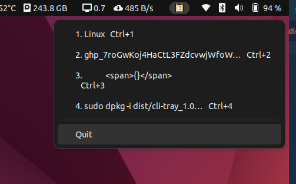
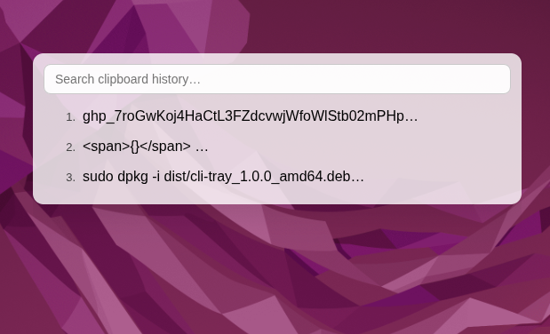

# CLI Tray

A cross-platform Electron clipboard history manager that lives in your system tray—featuring searchable history, quick keyboard shortcuts, and a sleek frosted-glass UI.

## Table of Contents

- [CLI Tray](#cli-tray)
  - [Table of Contents](#table-of-contents)
  - [Introduction](#introduction)
  - [Features](#features)
  - [Demo](#demo)
  - [Prerequisites](#prerequisites)
  - [Installation](#installation)
  - [Usage](#usage)
    - [Development](#development)
    - [Production Build](#production-build)
    - [Packaging Installers](#packaging-installers)
  - [Configuration](#configuration)
  - [Documentation](#documentation)
  - [Examples](#examples)
  - [Troubleshooting](#troubleshooting)
  - [Contributing](#contributing)
  - [Code of Conduct](#code-of-conduct)
  - [License](#license)
  - [Acknowledgements](#acknowledgements)

## Introduction

CLI Tray is a lightweight clipboard manager built on Electron and React. It stays hidden in your system tray (or menu bar) and tracks your copy history in real time. Invoke it with a global shortcut, search past entries, and re-copy with a single click or hotkey.

## Features

-   **100-item history**: Tracks up to 100 recent clipboard entries.
-   **Quick search**: Fuzzy-search your clipboard history via a translucent, rounded window.
-   **One-click copy**: Click an entry to re-copy it instantly.
-   **Keyboard shortcuts**:
    -   `Ctrl+Alt+1…0` (Windows/Linux) or `⌘+Alt+1…0` (macOS) to paste the first ten items.
    -   Global toggle: `Ctrl+Alt+M` / `⌘+Alt+M`.
-   **Auto-updates**: Uses GitHub Releases to keep you on the latest version.
-   **Cross-platform packaging**:
    -   Windows: `.exe`
    -   macOS: `.dmg`
    -   Linux: `.AppImage`, `.deb`

## Demo

<details>
  <summary>Click to expand screenshots</summary>

  <!-- Replace with actual screenshot paths -->




</details>

## Prerequisites

-   Node.js v14 or higher
-   npm or yarn

**Linux only:**

-   `xclip` or `xsel` (for clipboard access)
-   `wine` & `mono-devel` (for Windows `.exe` builds)

## Installation

```bash
# 1. Clone the repo
git clone https://github.com/<your-username>/cliptray.git
cd cliptray

# 2. Install dependencies
npm install
# or
yarn install
```

## Usage

### Development

Launch with hot-reloading:

```bash
npm run dev
# or
yarn dev
```

This runs both the Electron main process and a Webpack watcher for the React UI.

### Production Build

Bundle assets:

```bash
npm run build:react
# or
yarn build
```

Run locally:

```bash
npm start
# or
yarn start
```

### Packaging Installers

```bash
# Create an unpacked directory:
npm run pack
# or
yarn pack

# Build OS-specific installers:
npm run dist
# or
yarn dist
```

-   **Windows**: `dist/CLI Tray Setup <version>.exe`
-   **macOS**: `dist/CLI Tray-<version>.dmg`
-   **Linux**:
    -   `.AppImage`: `dist/CLI Tray-<version>.AppImage`
    -   Debian package: `dist/cliptray_<version>_amd64.deb`

## Configuration

Configuration is stored in a JSON file at:

-   **Linux/macOS**: `~/.config/cliptray/config.json`
-   **Windows**: `%APPDATA%\cliptray\config.json`

```json
{
    "maxHistoryItems": 100,
    "shortcutToggle": "Ctrl+Alt+M",
    "shortcutSlots": ["Ctrl+Alt+1", "..."],
    "windowOpacity": 0.8,
    "autoLaunchOnStartup": true
}
```

| Key                   | Type     | Default      | Description                             |
| --------------------- | -------- | ------------ | --------------------------------------- |
| `maxHistoryItems`     | number   | `100`        | How many items to keep in history       |
| `shortcutToggle`      | string   | `Ctrl+Alt+M` | Hotkey to open/close the history window |
| `shortcutSlots`       | string[] | `[...]`      | Hotkeys for slots 1–10                  |
| `windowOpacity`       | number   | `0.8`        | Opacity of the history pop-up (0–1)     |
| `autoLaunchOnStartup` | boolean  | `true`       | Start app when system boots             |

## Documentation

-   **API**: See `docs/API.md` for the internal IPC and configuration schema.
-   **Architecture**:
    -   **Main Process** (`src/main`): Handles tray/menu, global shortcuts, auto-updates.
    -   **Renderer** (`src/renderer`): React UI, search logic, theming.
-   **Contribution Guide**: `docs/CONTRIBUTING.md`.

## Examples

1. Copy text in another app (e.g., `Ctrl+C` in a browser).
2. Open search window: `Ctrl+Alt+V`.
3. Type a search term (e.g., `error log`) to filter entries.
4. Press `Enter` or click to re-copy it to your clipboard.
5. Use `Ctrl+Alt+1` to paste the most recent entry in any application.

## Troubleshooting

-   **Tray icon not appearing**:

    -   Ensure you’re not in a Wayland-only session on Linux; try with X11.
    -   Check verbose logs: `npm run dev -- --verbose`.

-   **Global shortcuts not working**:

    -   On macOS, grant “Accessibility” permissions in **System Preferences → Security & Privacy → Privacy → Accessibility**.

-   **Auto-update fails**:
    -   Confirm your GitHub token is set in `AUTO_UPDATE_TOKEN` environment variable for private releases.
    -   If issues persist, open an issue on GitHub.

## Contributing

We welcome contributions! Please follow these steps:

1. Fork the repo
2. Clone your fork:
    ```bash
    git clone https://github.com/<your-username>/cliptray.git
    cd cliptray
    git remote add upstream https://github.com/<original-owner>/cliptray.git
    ```

3. Create a feature branch:
   ```bash
    git checkout -b feature/my-cool-feature
    ```

4. Code, lint, test, and format:
    ```bash
    npm run lint
    npm test   # if tests added
    npm run format
    ```
5. Rebase regularly onto `upstream/main`:
   ```bash
    git fetch upstream
    git rebase upstream/main
    ```

6. Push your branch and open a PR against `master`.

Please review our Code of Conduct and Contribution Guidelines before submitting.

## Code of Conduct

This project follows the [Contributor Covenant v2.1](https://www.contributor-covenant.org/). Please read it to understand expected behaviors.

## License

MIT License

```
Copyright (c) 2025 <Your Name>

Permission is hereby granted, free of charge, to any person obtaining a copy
...
```

## Acknowledgements

-   Built with Electron and React
-   Inspired by [Ditto Clipboard](https://ditto-cp.sourceforge.io/) and [Flycut](https://github.com/TermiT/flycut)
-   Icons by [Feather Icons](https://feathericons.com/)
